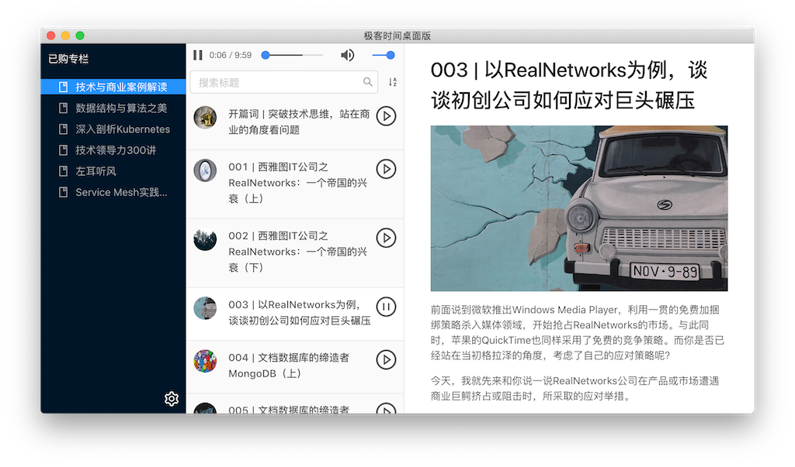

# geektime-desktop (极客时间桌面版)

  

> 下载地址 (for macOS/Windows) <https://github.com/shawjia/geektime-desktop/releases/latest>

## Feature

- [x] 账号登录
- [x] 专栏列表
- [x] 文章列表
- [x] 文章阅读
- [ ] 支持国外手机登录
- [ ] 文章排序
- [ ] 文章样式
- [ ] 视频课支持 (maybe)
- [ ] 音频播放 (maybe)
- [ ] 文章笔记 (maybe)

## FAQ

0. 为什么开发这个软件？

    > 官方没有出品桌面端，网页版文章导航较差。

1. 为什么我看不到内容？

    > 请点击左下角登录账号；如没账号，请[先注册](https://time.geekbang.org/activity/getinvite?gk_ucode=8CD7B77096D48A)。

2. 为什么我没办法用微信登录？

    > 非官方软件，不支持微信登录，请在官方 App 绑定手机后使用。

3. 为什么我注册登录后依旧看不到内容？

    > 请确保登录账号正确，且已经购买过课程。

4. 我能查看没有购买的课程吗？

    > 臣妾做不到呐。。。

5. 安装包好像有点大？

    > 基于 [Electron](https://electronjs.org/) 开发的 App 都这样，比如 Visual Studio Code。

6. 这个软件安全不，你会偷我账号吗？

    > 所有代码开源，还不放心，请抓包检验；对你的账号没兴趣。

7. 这软件好像没有数字签名？

    > 嗯，还没钱买数字证书；安装使用的时候可能会提示，请放心跳过。

8. 我还是不放心。。。

    > 88
